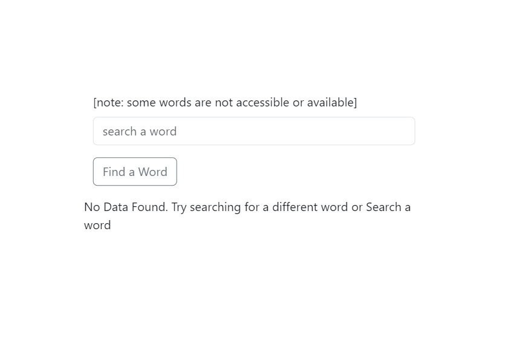

# Dictionary Search App

A simple React application that allows users to search for word definitions using the Dictionary API.

## Table of Contents

- [Features](#features)
- [Installation](#installation)
- [Usage](#usage)
- [API Key](#api-key)
- [Contributing](#contributing)
- [License](#license)

## Features

- Search for word definitions using the Dictionary API.
- Display word, phonetic, and example definitions.
- Loading indicator during API requests.
- Responsive design using Bootstrap.

## Installation

1. Clone the repository:

   ```bash
   git clone https://github.com/Dwidenbrahma/react-dictionary
   ```

## Screenshots


